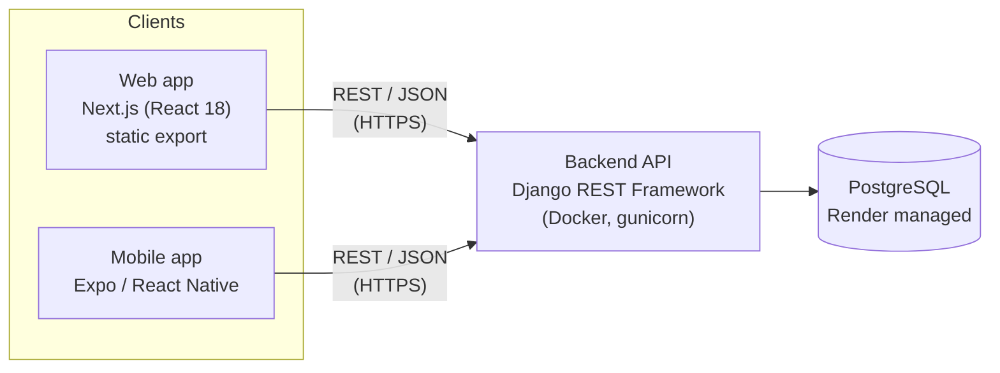
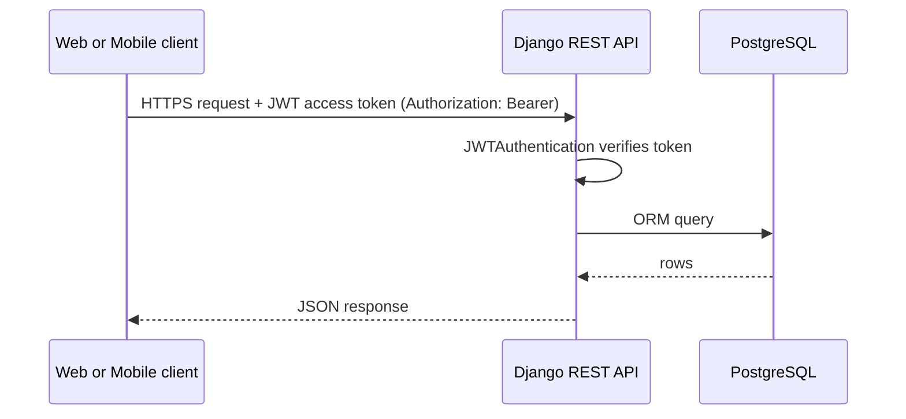
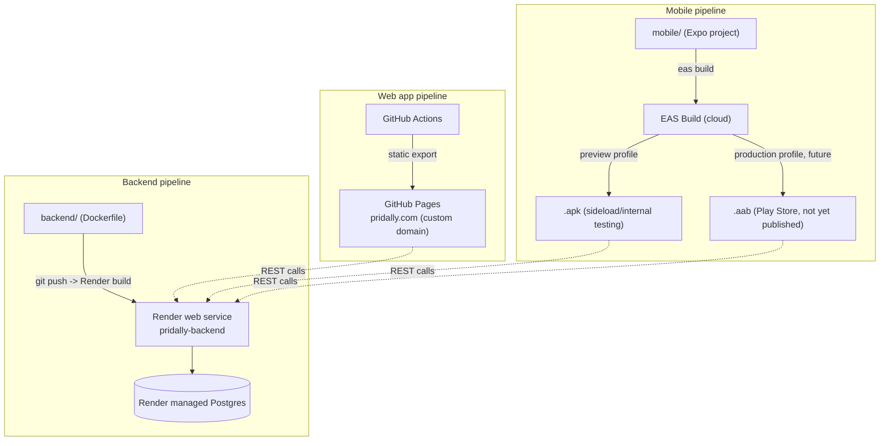
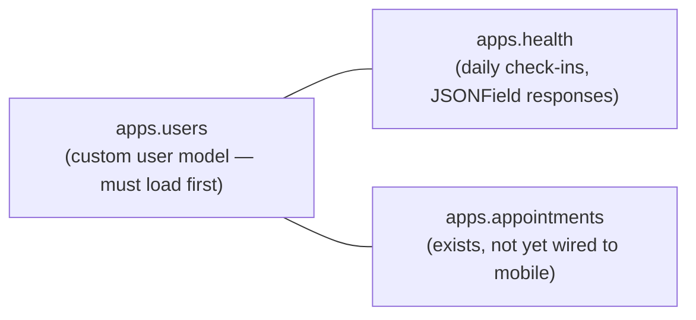

# Pridally — Architecture

Living document. Covers system components, how data flows between them,
and deployment topology. Does **not** cover secrets/keys/security
hardening — see `SECURITY.md` for that, per the split in
[`docs/README.md`](./README.md).

---

## 1. System overview

Three clients share one backend and one database — there is no separate
mobile backend or mock data anywhere:

Both clients call the exact same production API
(`https://pridally-backend.onrender.com`) — a change to a backend
endpoint is visible to web and mobile simultaneously; there's no
per-client duplication of business logic beyond UI rendering.

## 2. Components

| Component | Tech | Role |
|---|---|---|
| Web app | Next.js 15, React 18, TypeScript, Tailwind, static export | Public-facing site (`pridally.com`) — marketing pages + the same signup/login/check-in product as mobile |
| Mobile app | Expo (React Native), TypeScript | Android/iOS client — auth, dashboard, check-in, profile today; appointments/calendar/chatbot/onboarding are the current build targets (see `mobile/PROJECT_DOCUMENTATION.md` §8–9) |
| Backend API | Django 4.2 + Django REST Framework | Single source of truth for all business logic and data; three Django apps: `apps.users`, `apps.health` (check-ins), `apps.appointments` |
| Database | PostgreSQL (Render managed) | One database, shared by both clients via the API — no client ever talks to the DB directly |

No client holds business logic that the backend doesn't also enforce —
e.g. validation happens server-side, clients are presentation + local
session state only.

## 3. Request flow (typical read/write)

Every authenticated endpoint requires a valid JWT access token; there is
no session-cookie auth path — both web and mobile follow the same
token-based flow. (Token issuance/refresh mechanics and lifetimes belong
in `SECURITY.md`, not here.)

## 4. Deployment topology

Three independent deploy pipelines, one shared backend target:

- **Web**: `next build` (static export) → GitHub Actions → GitHub Pages,
  custom domain `pridally.com`. Backend URL is baked in at build time via
  `NEXT_PUBLIC_API_URL` (see `DEPLOYMENT.md` at repo root).
- **Backend**: Docker image built from `backend/Dockerfile`, deployed to
  a Render web service (`render.yaml`) running `gunicorn`, with a Render
  managed Postgres database attached.
- **Mobile**: no native project checked into the repo — EAS Build
  compiles the Expo project in the cloud. `preview` profile → `.apk`
  (sideloadable, used today); `production` profile → `.aab` (needed for
  Play Store, not yet used — see `mobile/PROJECT_DOCUMENTATION.md` §10).

## 5. Backend app boundaries

- `apps.users` is listed first in `INSTALLED_APPS` because it defines the
  custom user model other apps' foreign keys depend on.
- `apps.health` stores check-ins with a flexible `responses` `JSONField`,
  which is how both the general check-in form and the 5 per-category
  health cards (mental/sexual/reproductive/physical/social) store answers
  without needing a new column per question.
- `apps.appointments` already exists server-side but has no mobile UI
  yet — it's one of the four gaps being closed for feature parity.

## 6. Where in-progress feature work plugs in architecturally

These map to `mobile/PROJECT_DOCUMENTATION.md` §8's parity targets — noted
here so the *architectural* shape is decided before the screens are built:

| Feature | Backend | New architecture needed? |
|---|---|---|
| Appointment scheduling (mobile) | `apps.appointments` (exists) | No — same REST pattern as check-ins, just new mobile screens + API client methods |
| Health calendar / weekly stats | `apps.health` (exists — check-ins already have dates) | No — likely a new read-only aggregation endpoint, still REST |
| Chatbot | New | Yes, if streaming/typing indicators are wanted — **Django Channels** for WebSocket support alongside the existing REST app, not a replacement for it. If it's simple request/reply, plain REST is enough and no new architecture is needed. |
| Onboarding (health pathway selection) | `apps.users` or `apps.health` (likely a new field/model) | No — REST, just new screens + a small model addition |

## 7. Future consideration (not needed now)

**RBAC / multiple roles.** Today there's exactly one role — authenticated
user — and every endpoint is already scoped to `request.user`. No action
needed unless/until one of these becomes a real plan: doctors logging in
themselves (vs. being managed via Django admin), or an NHS/university
partner-facing dashboard (per the site's solution pages) needing an
org-admin role. Noted 2026-08-04 purely as a forward flag, not a decision.

## 8. Explicitly out of scope for this document

- Secrets, API keys, JWT signing details, token lifetimes, CORS
  allow-lists, rotation policy → `SECURITY.md`
- Visual design, component library, design tokens → `UI_UX_DESIGN.md`
- Web-specific code structure/conventions → `FRONTEND.md`
- Django app internals (models, serializers, views in detail) →
  `BACKEND.md`

---

## Changelog

- **2026-08-04** — Initial architecture document: system overview
  (web/mobile/backend/DB), request flow, deployment topology for all
  three pipelines (GitHub Pages, Render, EAS Build), backend app
  boundaries, and an architectural mapping of the four feature-parity
  gaps (appointments, calendar/stats, chatbot, onboarding) to what each
  would need. Established the `docs/` split described in
  `docs/README.md`.
- **2026-08-04** — Added §7, a forward-looking note on RBAC: not needed
  today (single role, already correctly scoped per-user), revisit only
  if doctor self-login or an institutional partner dashboard becomes a
  real plan.
