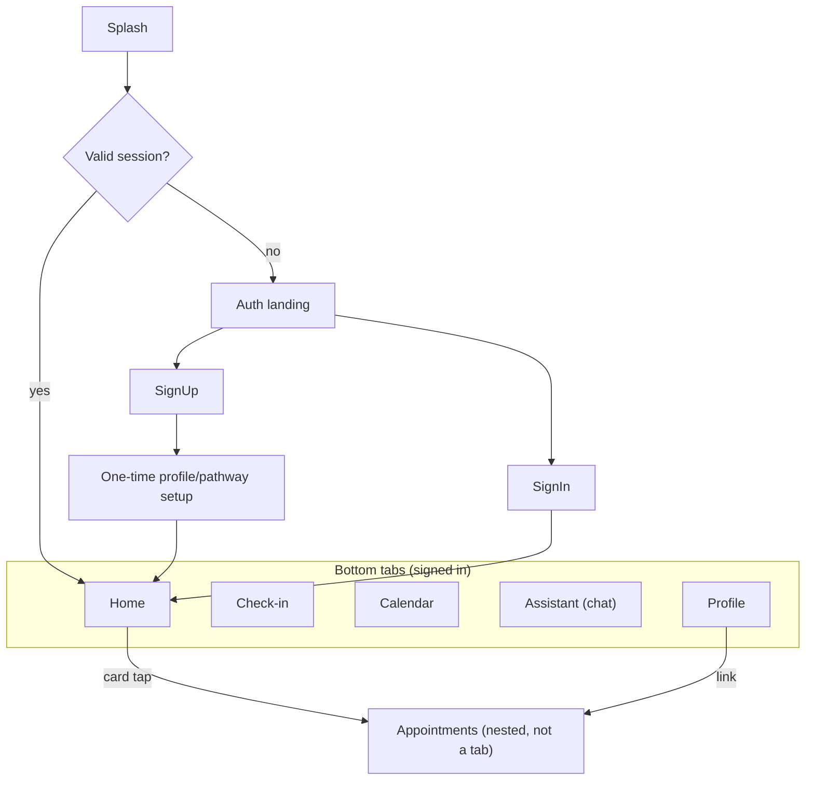

# Pridally Mobile — UI/UX Design

Living document. Covers screen-by-screen UX for the mobile app, the
navigation structure, and the design principles behind the choices.
Visual system change: what the codebase calls "the web app" refers to
`app/`, `src/` at the repo root — used as ground truth for *what data and
features exist*, not as the visual template to copy, since it's a desktop
web layout, not a mobile-native one.

Secrets/security are out of scope here (see `SECURITY.md`); backend
model/endpoint detail is out of scope here (see `BACKEND.md`) — but this
doc does flag backend gaps where they block a screen from being real
rather than mocked, since that affects build order.

---

## 1. Why the current auth screens read as "ported web forms"

Looked at `LoginScreen.tsx` / `SignupScreen.tsx` as they exist today.
Concretely, three things make them feel like a web form rather than a
native mobile flow:

1. **Everything visible at once.** Signup shows first name, last name,
   email, password, confirm-password all in one scroll — a desktop
   pattern. Native mobile apps (Duolingo, Notion, Headspace) use
   **progressive disclosure**: one focused decision per screen.
2. **No native affordances.** No show/hide password toggle, no
   "Forgot password?" link, no keyboard-chaining (tapping "next" on the
   keyboard should jump to the next field, not require tapping the
   screen), no biometric quick-unlock for a returning user.
3. **No app-shell feel.** No back-chevron pattern between related auth
   screens, no progress indicator, nothing that signals "this is a
   sequence," just two independent full-page forms.

None of this needs new backend work — it's purely mobile-side UX, so it's
a good first target.

## 2. Navigation structure (information architecture)

**Recommendation: 5 bottom tabs**, appointments reached *from* Home
rather than given its own tab — appointment booking happens far less
often than a daily check-in, and a 6th tab is the point most apps start
feeling cluttered.



## 3. Screen-by-screen

### 3.1 Splash screen
Brand mark on `colors.background`, no spinner text — just the logo,
while the app silently checks `AsyncStorage` for a stored JWT and
attempts a refresh. This already effectively exists via `AuthContext`'s
bootstrap; make it a real screen (not a blank flash) so cold app-open
doesn't look broken.

### 3.2 First-run onboarding carousel — **built**
3 swipeable slides, skippable, shown once (flag stored locally):
1. What Pridally does (one sentence + illustration)
2. "Your check-ins are private" (trust/privacy reassurance — matters more
   for a health app than for a typical app)
3. A glimpse of the 5 health categories

Ends on the Auth landing screen. Skippable at any point via a top-right
"Skip" — never force a user through slides to reach sign-in.

**Built (2026-08-04).** Swipe paging uses plain `ScrollView` with
`pagingEnabled` — no carousel library needed. The "shown once" flag is a
device-local AsyncStorage value checked at boot in `Navigation.tsx`,
ahead of the auth/pathway/main-tabs chain — it's tied to the device
install, not the account, so signing out never re-triggers it.

### 3.3 Auth landing — **built**
Full-bleed brand screen — this replaces jumping straight into a form:

```
┌─────────────────────────────┐
│                              │
│        [ mascot/logo ]      │
│                              │
│         Pridally             │
│  Your daily wellness guide  │
│                              │
│  ┌────────────────────────┐  │
│  │     Create Account     │  │  ← primary, filled
│  └────────────────────────┘  │
│  ┌────────────────────────┐  │
│  │       Sign In           │  │  ← secondary, outline
│  └────────────────────────┘  │
└─────────────────────────────┘
```

### 3.4 Sign in (redesigned)
```
┌─────────────────────────────┐
│ ←                            │
│   Welcome back                │
│                              │
│  Email                       │
│  [ you@example.com        ]  │
│  Password              👁    │
│  [ ••••••••••             ]  │
│                 Forgot password? │
│                              │
│  ┌────────────────────────┐  │
│  │       Sign In           │  │  ← sticky bottom
│  └────────────────────────┘  │
└─────────────────────────────┘
```
Adds vs. current: back-chevron to Auth landing (not a dead-end), password
visibility toggle, "Forgot password?" (currently just missing — flagged
weeks ago as a gap; this is where it plugs in, though the reset-password
*flow* itself needs a backend endpoint — `BACKEND.md`), keyboard "next"
chained from email → password, CTA pinned to the bottom instead of
inline in scroll flow.

**Built (2026-08-04), with two deliberate deferrals at the time:**
password show/hide toggle and keyboard "next" chaining shipped
immediately. The back-chevron was deferred until Auth landing existed —
**now resolved** (§3.3 shipped the same day) — it calls
`navigation.goBack()` rather than a hardcoded target, so it correctly
returns to Auth landing or to Signup if that's how the user actually got
here. **"Forgot password?"** remains deferred — confirmed via
`docs/BACKEND.md` §5 that no password-reset endpoint or outbound-email
sending exists at all, so a real link would have nowhere to go; building
a placeholder that doesn't work was rejected as worse than not having it
yet.

**Returning-device quick path (recommended, v1.1 not launch-blocking):**
if a device previously had a valid session, offer "Sign in with
Face ID / Fingerprint" above the form via `expo-local-authentication`,
falling back to the password form. Purely a convenience layer over the
same JWT flow — no new backend work.

### 3.5 Sign up — **decided: 3-step progressive (Option A)**

**Option A — Recommended: 3-step progressive flow**
```
Step 1/3            Step 2/3             Step 3/3
┌───────────┐       ┌───────────┐        ┌───────────┐
│ ←    ●○○  │       │ ←    ●●○  │        │ ←    ●●●  │
│ What's your│       │ Create a  │        │ Almost    │
│ email?     │       │ password  │        │ done       │
│[_________] │       │[_________]│        │[First name]│
│            │       │[_confirm_]│        │[Last name] │
│            │       │ ✓8+ chars │        │            │
│ [Continue] │       │ ✓ match   │        │[Create acc.]│
└───────────┘       └───────────┘        └───────────┘
```
One decision per screen, live checklist validation on the password step
(feels responsive, not "submit and get yelled at"), a step-dot indicator
so it doesn't feel endless. This is the pattern most consumer apps use
and reads as clearly mobile-native — more screens/state to build than
option B.

**Decision (2026-08-04): Option A.** Build the 3-step progressive flow.

### 3.6 One-time profile / pathway setup — **built**

Found a real mismatch worth surfacing before building this screen: the
**web app's** onboarding (`GenderIdentityForm.tsx`) collects preferred
name, pronouns, and age range, under a `pathway` of `'pryd'` vs `'ally'`
(identity-based) — and only saves it to **`localStorage`**, never to the
backend. The **backend's** `CustomUser` model already has a
`health_pathway` field, but with completely different values:
`fitness` / `nutrition` / `mental_health` / `general` (goal-based, not
identity-based), plus an `onboarding_completed` boolean. These are two
different concepts that happen to share the word "pathway" — building
mobile onboarding requires deciding which one is real:

**Decision (2026-08-04): goal-based.** A single-choice screen — pick a
wellness pathway: fitness / nutrition / mental health / general — then
`PATCH` the user record to set `health_pathway` and
`onboarding_completed=true`. Matches the backend exactly, no backend
change needed. The web form's identity-based fields (preferred
name/pronouns/age) are **not** carried over to mobile onboarding under
this decision — mobile does not inherit that mismatch.

```
┌─────────────────────────────┐
│   What brings you here?      │
│                              │
│  ┌────────────────────────┐  │
│  │ 🏋️  Fitness              │  │
│  ├────────────────────────┤  │
│  │ 🥗  Nutrition            │  │
│  ├────────────────────────┤  │
│  │ 🧠  Mental Health        │  │
│  ├────────────────────────┤  │
│  │ 🌱  General Wellness     │  │
│  └────────────────────────┘  │
│                              │
│  ┌────────────────────────┐  │
│  │        Continue          │  │
│  └────────────────────────┘  │
└─────────────────────────────┘
```

### 3.7 Home / Dashboard (tab 1) — **built**
```
┌─────────────────────────────┐
│  Hi Meghana 👋          🔔 👤│
│                              │
│  🔥 4-day streak              │  ← new, from calendar/streak logic
│                              │
│  Today's check-in            │
│  ┌────────────────────────┐  │
│  │ Mood: Good · Energy: 7  │  │
│  │ [ Update check-in ]     │  │
│  └────────────────────────┘  │
│                              │
│  Health categories            │
│  ⭕60% Mental   ⭕20% Sexual   │  ← progress rings, not flat bars
│  ⭕0%  Repro.   ⭕80% Physical │
│  ⭕40% Social                 │
│                              │
│  📅 Upcoming: Dr. Chen, Thu 2:30│ ← only if an appointment exists
└─────────────────────────────┘
```
Keeps the existing check-in status card and 5-category grid (already
functional, per `mobile/PROJECT_DOCUMENTATION.md` §7), adds a streak
callout (motivational, cheap to compute from existing check-in dates) and
an upcoming-appointment teaser card that deep-links to Appointments.
Progress rings instead of flat bars read as more native/polished
(closer to Apple Fitness-style rings) — a visual change to the existing
cards, not new data.

**Decision (2026-08-04): kept flat bars.** Rings would need a new
`react-native-svg` dependency; call was to skip that for now — pure
visual polish, not a functional need. Streak card and appointment
teaser are built exactly as described, with two things deliberately
left out for the same reason as earlier deferrals: the 🔔 notifications
icon (no push infra or notification center exists) and tap-through on
the appointment card (its destination, §3.11, isn't built yet).

**Extended beyond this spec (2026-08-05):** added a "Last 30 days"
analytics section (check-in count, average mood/energy/sleep, total
exercise) using `checkinsApi.stats()` — an already-existing backend
endpoint no client had wired up until now — plus sleep/exercise/water in
the today's-check-in card, previously mood/energy only. Not in the
original mockup; added because the data being collected was more than
the dashboard was showing.

### 3.8 Check-in (tab 2)
Existing general form + per-category deep-dive stays as-is structurally
(it already works — §7 of the mobile doc). One addition worth it:
**date navigation** (‹ Today ›) so a missed day can be filled in
retroactively, which also gives the Calendar tab (3.9) something to link
into when tapping a past day.

### 3.9 Calendar / Progress (tab 3) — **built, with a correction**
Ports `HealthCalendar.tsx`'s logic (month grid, ✓/✗ per day, streak) into
a native month grid. Tapping a completed past day shows that day's
answers read-only; tapping a missed day jumps to Check-in with that date
selected (uses the date-navigation from 3.8). Streak + completion-rate
stat row above the grid.

**Correction found while building (2026-08-04):** the "tap a missed day
to fill it in retroactively" interaction described above **isn't
possible today** — not a missing-UI problem but a backend data-model one.
`DailyCheckIn.check_in_date` is `auto_now_add=True` and read-only, so
every check-in is always dated "today" regardless of what's sent (see
`docs/BACKEND.md` §5). Built instead: tapping any day up to and including
today shows a detail panel (real answers if a check-in exists, "no
check-in recorded" if not, or a "Start today's check-in" button if it's
today and empty); future days are disabled, not tappable. Also scoped
down to **the current month only, no prev/next navigation** — the
backend only exposes `weekly`/`monthly` (last 7/30 days) and a plain
paginated list, no arbitrary-month query, so there's no data to show for
other months without a backend addition. Neither omission is
half-finished UI standing in for a real feature — both are real limits,
documented rather than faked.

### 3.10 Assistant / Chat (tab 4) — **built**
Web's `HealthChatbot.tsx` is **not real AI** today — it's a client-side
keyword matcher (`if message.includes('sleep')` style canned responses),
with no backend persistence of the conversation.

**Decision (2026-08-04): port the same scripted keyword-response logic**
to mobile — meets feature parity with zero new backend work or per-message
cost. Upgrading to a real LLM-backed assistant is deferred; when/if that
happens later, it's a backend-endpoint addition behind the same chat UI,
not a screen redesign, plus a decision on health-advice disclaimer
language at that time.

**Built (2026-08-04)** as "LiLo" (the site's mascot name), with one
improvement over a literal port: the "analyze my progress" branch uses
real data (`checkinsApi.monthly()` + `checkinsApi.today()`) instead of
web's mocked stats — same scripted-response approach, but the one number
it reports back is true. No conversation persistence, matching web's own
limitation (not a mobile regression).

### 3.11 Appointments (nested from Home/Profile, not a tab) — **built**
```
┌─────────────────────────────┐
│ ←  Appointments               │
│                              │
│  Upcoming                     │
│  ┌────────────────────────┐  │
│  │ Dr. Chen · Mental Health│  │
│  │ Thu, Aug 20 · 2:30 PM   │  │
│  │ 🎥 Video call            │  │
│  └────────────────────────┘  │
│                              │
│  [ + Book appointment ]      │
│                              │
│  Past                         │
│  Dr. Johnson · completed ✓    │
└─────────────────────────────┘
```
**Correction (2026-08-04):** an earlier draft of this doc claimed the
appointments API didn't exist yet. That was wrong — checking
`backend/core/urls.py`'s router (not a per-app `urls.py`, which this
project doesn't use) shows `DoctorViewSet` and `DoctorAppointmentViewSet`
are fully built: CRUD plus `upcoming`/`past`/`cancel`/`reschedule`/
`complete`/`rate`/`stats` actions. See `docs/BACKEND.md` for the full
endpoint reference. The web `DoctorScheduling.tsx` UI itself still uses
mock `useState` data rather than calling this API, but the API this
mobile screen needs is already there — **no backend work required**,
this is now a mobile-only screen + API client methods, same as
appointments' entry in `docs/ARCHITECTURE.md` §6 said all along. The one
real gap: there's no seed data, so `Doctor` records need to be added via
Django admin before booking has anything to book against.

**Built (2026-08-04).** Added one new dependency —
`@react-native-community/datetimepicker` — for real native date/time
pickers in the booking form, over the plain-text-fields alternative that
was considered. Not yet confirmed to render in Expo Go, since it's the
project's first dependency with actual native code; may need a fresh
build to test rather than the usual `npm start`. The "no `Doctor` seed
data" gap above is **resolved as of 2026-08-05** — see `docs/BACKEND.md`
§5 — though it still needs a deploy to reach production; the booking
form's graceful empty state ("No doctors available yet") stays in place
regardless, since it's correct behavior for any future gap in doctor
coverage, not just this one.

### 3.12 Profile (tab 5, redesigned)
Adds to the existing screen (name/email/sign-out): edit profile
(name, DOB, phone — `CustomUser` already has these fields), notification
preference toggle (`UserProfile.notification_enabled` already exists),
and **account deletion** — required by Play Store policy for any app
with account creation, currently missing entirely (flagged in
`mobile/PROJECT_DOCUMENTATION.md` §10's Play Store roadmap).

---

## 4. Design principles applied throughout

- **One primary action per screen** where possible — avoid the "wall of
  fields" pattern.
- **Sticky bottom CTA** instead of a button that scrolls with content.
- **Validate as you type**, not only on submit.
- **Native platform gestures respected** — swipe-back on iOS, hardware
  back button on Android should always make sense (go to the previous
  logical step, never a dead end).
- Existing palette (`mobile/src/theme/colors.ts`) carries through
  unchanged — this doc is about layout/flow, not new colors.

## 5. Decisions log

All three open decisions from the first draft of this doc were resolved
2026-08-04:

1. Sign-up: **3-step progressive** (§3.5)
2. Onboarding pathway: **goal-based**, matching the backend's
   `health_pathway` field as-is (§3.6)
3. Assistant: **scripted**, matching web's current logic; real LLM
   deferred (§3.10)

No open UI/UX decisions remain — ready to move into implementation or
into `FRONTEND.md`/`BACKEND.md` for the pieces that need backend work
first (appointments API, onboarding `PATCH` endpoint usage).

---

## Changelog

- **2026-08-04** — Initial UI/UX design doc: navigation IA (5 tabs,
  appointments nested not tabbed), critique of current auth screens vs.
  native patterns, screen-by-screen mockups for onboarding carousel,
  auth landing, sign in/up, pathway setup, home, check-in, calendar,
  assistant, appointments, profile. Surfaced two real gaps found while
  reviewing the web app as ground truth: `apps.appointments` has models
  but no exposed API (`urls.py` empty), and the web onboarding form's
  identity-based "pathway" concept doesn't match the backend's
  goal-based `health_pathway` field — both flagged as open decisions
  rather than resolved silently.
- **2026-08-04** — Resolved all three open decisions: sign-up is the
  3-step progressive flow, onboarding is goal-based (matches
  `health_pathway` as-is, no backend change), Assistant ships with the
  scripted keyword-response logic ported from web (real LLM deferred).
  No open UI/UX decisions remain.
- **2026-08-04** — Corrected §3.11: the appointments API was already
  fully built (found while writing `docs/BACKEND.md`) — the "empty
  urls.py" finding was a false negative from checking the wrong file in
  a project that centralizes routing in `core/urls.py`.
- **2026-08-04** — Built the sign-in screen (§3.4): password show/hide
  toggle, keyboard chaining. Deliberately deferred back-chevron (no Auth
  landing screen exists yet to go back to) and "Forgot password?" (no
  backend password-reset endpoint exists — confirmed, tracked in
  `docs/BACKEND.md` §5) rather than build either half-finished.
- **2026-08-04** — Built Auth landing (§3.3), the auth stack's new
  initial route. Resolved the back-chevron deferral on both Login and
  Signup's step 1 by switching to `navigation.goBack()`. "Forgot
  password?" remains deferred — still blocked on the backend gap.
- **2026-08-04** — Built the pathway setup screen (§3.6). Gates
  `Navigation.tsx` on `user.onboarding_completed` rather than being a
  stack route — a new signup lands here automatically, no extra
  navigation wiring needed. Used the existing two-call sequence (PATCH
  `health_pathway` + `POST complete_onboarding`) instead of extending
  the backend action, to avoid a deploy dependency for this screen.
- **2026-08-04** — Built the Home/Dashboard redesign (§3.7): tappable
  avatar → Profile, streak card (client-computed from
  `checkinsApi.monthly()`), upcoming-appointment teaser (real data via a
  new `appointmentsApi.upcoming()`). Decided to keep flat progress bars
  rather than add `react-native-svg` for rings. Notifications icon and
  appointment-card tap-through both deferred — no backend/screen behind
  either yet.
- **2026-08-04** — Built the Appointments screen and booking flow
  (§3.11): `AppointmentsScreen.tsx` (Upcoming/Past) and
  `BookAppointmentScreen.tsx` (doctor picker, type chips, native
  date/time picker, reason/notes). Added
  `@react-native-community/datetimepicker` — the project's first
  dependency with real native code. Resolved both deferrals from §3.7:
  the Dashboard appointment card is now tappable, and Profile got a new
  "Appointments" link.
- **2026-08-04** — Built the Calendar tab (§3.9), current-month-only
  (no prev/next — backend has no arbitrary-month query). Corrected the
  "tap a missed day to backfill it" idea from the original draft — found
  it's blocked by a real backend constraint (`check_in_date` is
  `auto_now_add`), not a missing-UI gap; tracked in `docs/BACKEND.md`
  §5. Extracted `categoryProgress` (into `healthMetrics.ts`) and
  `computeStreak`/`dateKey` (into a new `src/lib/streak.ts`) out of
  `DashboardScreen.tsx` so Calendar could reuse the same logic instead
  of duplicating it.
- **2026-08-04** — Built the Assistant tab (§3.10) as "LiLo": scripted
  keyword responses ported from web's `HealthChatbot.tsx`, with the
  progress-analysis branch upgraded to use real check-in data instead of
  web's mock.
- **2026-08-04** — Built the onboarding carousel (§3.2) — plain
  `ScrollView` paging, no new dependency, device-local AsyncStorage flag
  checked at boot ahead of the rest of the navigation chain. **Every
  screen in §3.2–§3.12 is now built.**
